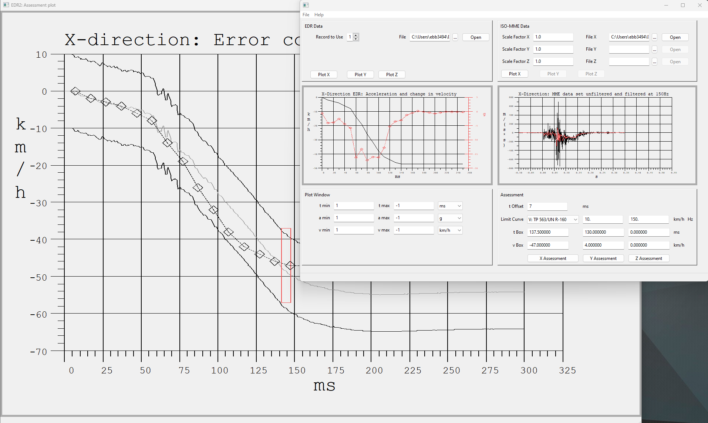

# EDR2
EDR2 can be used to compare the output of the Bosch Crash Data Retrieval tool with corresponding data obtained by full scale crash tests.

## Documentation
The program should be self-explanatory: the left half of the window is used to select the data of the Event Data Recorder, given in Bosch CDR \*.csv format. After pressing the "Open" button, preview plots can be shown in the middle section of the window.

Input data of crash tests in ISO-MME format is processed using the right half of the window.

After pressing the "Assessment" buttons a new window will be shown, comparing EDR and MME data. The plot can be modified by the lower input fields. The following criteria for assessing the accuracy of the EDR data are implemented:

Velocity:

-  SAE J1689: based on Butterworth filtering
-  SAE J1689 adjusted: additional offset correction
-  LTP 563: same as UN R-160, maximum upper/lower discrepancy

Acceleration:

- UN R-160: maximum upper/lower discrepancy

Hardcopies can be created via the "file" menu. The path and format (bmp or jpg) is defined by the \*.xml initialization files.

## Installation

The installation does not require administrator rights. Unzip the archive file. The ready-to-use executable, along with localization files for German and French, is located in the /bin subdirectory. Copy its whole content, including all contained subdirectories, to a local directory. Create a link to the exe-file, move the link to the desktop or startmenu, and change the working directory to an appropriate user directory by modifying the properties of the link. 

The initialization at program start is divided into two steps: the file EDR2config.xml chains to the file EDR2UserInit-de.xml in the same directory. Here individual settings are defined. If the local installation is used by several users, the link could be changed to a file in the working directory (filename without "%:") in order to allow user specific settings. You will find all possible settings in the example EDR2config_FullTemplate.xml.

## Build

The sources are compiled by the MinGW-w64 flavour of the GNU compiler collection, in collaboration with the Flex lexical analyser generator. The GUI was created by the Code::Blocks IDE.

Extract the complete directory tree and open a CMD console in the /build subdirectory. Window users can use the three batch files getfiles.bat, purge.bat and putfiles.bat.

Note: The batchfiles are protected against del \*.\* in the console, but not against deletion by the Windows Explorer! To clean up the /Build directory, use  ">purge"  / ">del \*.\*" in the command terminal. 

Copy the necessary files by executing getfiles.bat, selecting the correct target. At this time, there is only one option ">getfiles wx".

Now you can modify/compile the sources using Code::Blocks and EDR2.cbp. Without using an IDE, you can adapt the first lines of the batchfile MakeEDR2.bat according to your GCC installation and do the compiling.

Some EDR and MME files are included for testing purposes.

The executable and all related files are created in the /build subdirectory. From here they should be copied to the /bin subdirectory using ">putfiles.bat wx".

## Open content

The sources of the public domain components used are stored in the /OpenContent directory.
